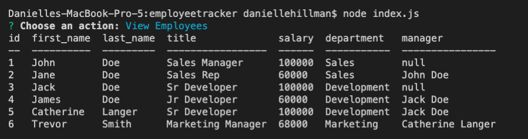
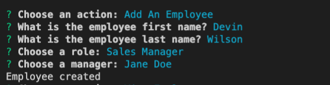
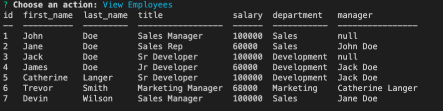
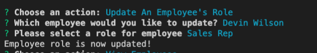
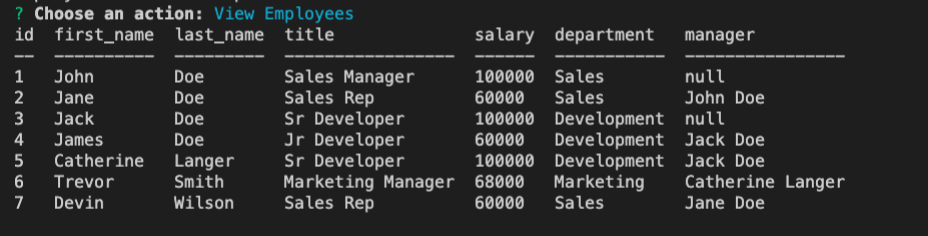
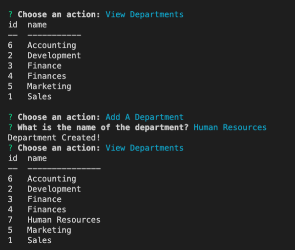
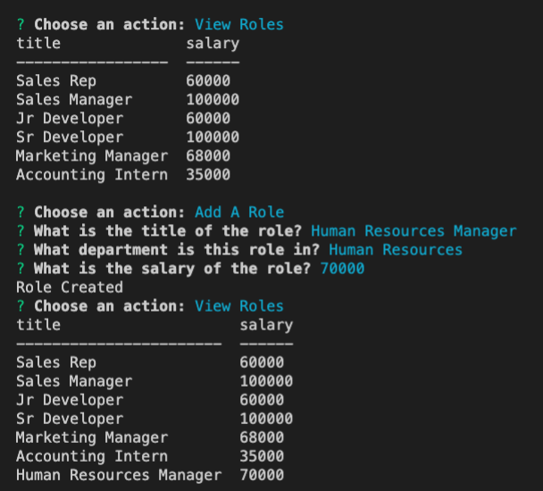
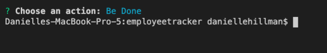

# Employee Tracker

Created by me: *Danielle Hillman*

## View Employees

After starting the program, the user has options for their employee tracker. They can view the current employees and their information.

### Add Employee

The user can add an employee to the list with a role and manager.

Then if you view employees, the new employee will be added.

### Change Employee Role

The user can change an employee's role if it changes. 

Then if you view employees, the new employee's role will be added.

### Add Department

The user can add a department to the list. 

### Add Role

The user can add a role to the list into a specific department. 

### End program

Once the user has inputted everything they want, they can end the program.

## Video

Video name: employeetracker

Link to Video: https://drive.google.com/drive/folders/1DT1ZBO42LacoAtv2lfW_e3EbhNZ7us_u

